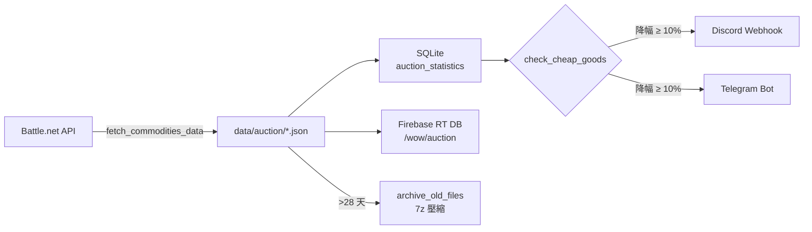

# 魔獸世界拍賣場價格監控系統

從 Battle.net API 抓取台灣伺服器拍賣場即時資料，計算 28 天滾動統計，將顯著降價物品透過 Discord / Telegram 通知。

## 功能特色

- **即時資料抓取**：從 `https://tw.api.blizzard.com` 取得全球商品價格快照（每份約 10 MB）
- **28 天滾動統計**：以 SQLite + pandas 計算每個物品的最低/最高/中位數/數量
- **雲端同步**：價格寫入 Firebase Realtime Database / Firestore，JSON 快照可選擇性上傳至 Cloud Storage
- **降價警示**：相較 7 天均價降幅 ≥ 10% 且歷史最低 ≥ 10,000 G 的物品自動推播 Discord + Telegram
- **自動封存**：超過 28 天的 JSON 快照按月壓縮為 `auction-{YYYYMM}.7z`

## 技術棧

| 層級 | 技術 |
|------|------|
| 程式語言 | Python 3.8+ |
| 資料處理 | pandas 2.3.3 |
| 本地儲存 | SQLite |
| 雲端 | Firebase（RT DB / Firestore / Cloud Storage） |
| 資料來源 | Battle.net API（OAuth2 Client Credentials） |
| 通知 | Discord Webhook、Telegram Bot |
| 報表 | Google Sheets（gspread） |
| 封存 | py7zr（7z 壓縮） |
| 測試 | pytest（86 個案例） |
| 排程 | Windows 工作排程器（每 4 小時） |

## 快速開始

### 1. 環境準備

```bash
# 建立 Anaconda 環境
conda create -n wow-auction python=3.11
conda activate wow-auction

# 安裝相依套件
pip install -r requirements.txt
```

### 2. 設定憑證

於 `app/configs/` 放入 5 份憑證 JSON（範例請見 [docs/CONFIGURATION.md](docs/CONFIGURATION.md)）：

- `battle-net-cred.json` — Battle.net Developer 申請
- `firebase-cred.json` — Firebase Service Account
- `discord-webhook.json` — Discord 伺服器 Webhook URL
- `telegram-bot.json` — Telegram BotFather token + chat_id
- `google-auth.json` — Google Cloud Service Account（Sheets 用，可選）

### 3. 執行

```bash
python start.py
```

或於 Windows 環境用 `start.bat`（需自行建立，內容範例見 [docs/DEPLOYMENT.md](docs/DEPLOYMENT.md)）。

## 目錄結構

```
wow-auction/
├── start.py                    # 進入點
├── requirements.txt            # 套件清單
├── app/
│   ├── controllers/            # 業務邏輯（AuctionController）
│   ├── services/               # 外部服務（Battle.net / Firebase / Sheets）
│   ├── repositories/           # API 呼叫（WowGameData）
│   ├── helpers/                # 驗證器
│   └── configs/                # 設定檔 + 憑證（憑證已 .gitignore）
├── data/
│   ├── db.sqlite               # SQLite 資料庫
│   ├── item_class.json         # 物品分類參考
│   └── auction/                # 每日 JSON 快照 + archived/
├── tests/                      # pytest（unit + integration）
├── logs/                       # 執行日誌
└── docs/                       # 詳細文件（見下方）
```

## 文件索引

| 文件 | 內容 |
|------|------|
| [docs/ARCHITECTURE.md](docs/ARCHITECTURE.md) | 架構圖、資料流、模組職責、SQLite ER 圖、Firebase 路徑 |
| [docs/DEPLOYMENT.md](docs/DEPLOYMENT.md) | 環境建置、憑證準備、Windows 排程器、故障排查 |
| [docs/CONFIGURATION.md](docs/CONFIGURATION.md) | settings.json / tracked_items.json 欄位、5 份憑證範例 |
| [docs/API-MAPPING.md](docs/API-MAPPING.md) | Battle.net 端點、Firebase 路徑、通知 payload 規格 |
| [CLAUDE.md](CLAUDE.md) | 專案規範與架構摘要（同時供 Claude Code Agent 參考） |
| `.claude/Task.md` | 已完成任務歷史 |
| `.claude/Todo.md` | 待辦項目 |

## 核心執行流程



## 測試

```bash
# 執行全部測試（63 unit + 23 integration）
pytest

# 含覆蓋率
pytest --cov=app --cov-report=term-missing
```

## 維護者

個人專案，不接受外部貢獻。
