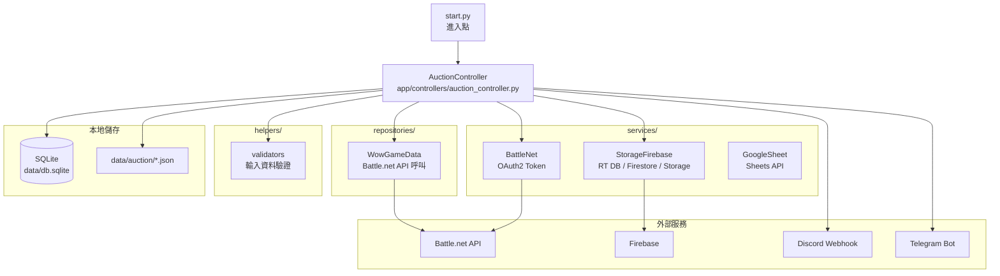
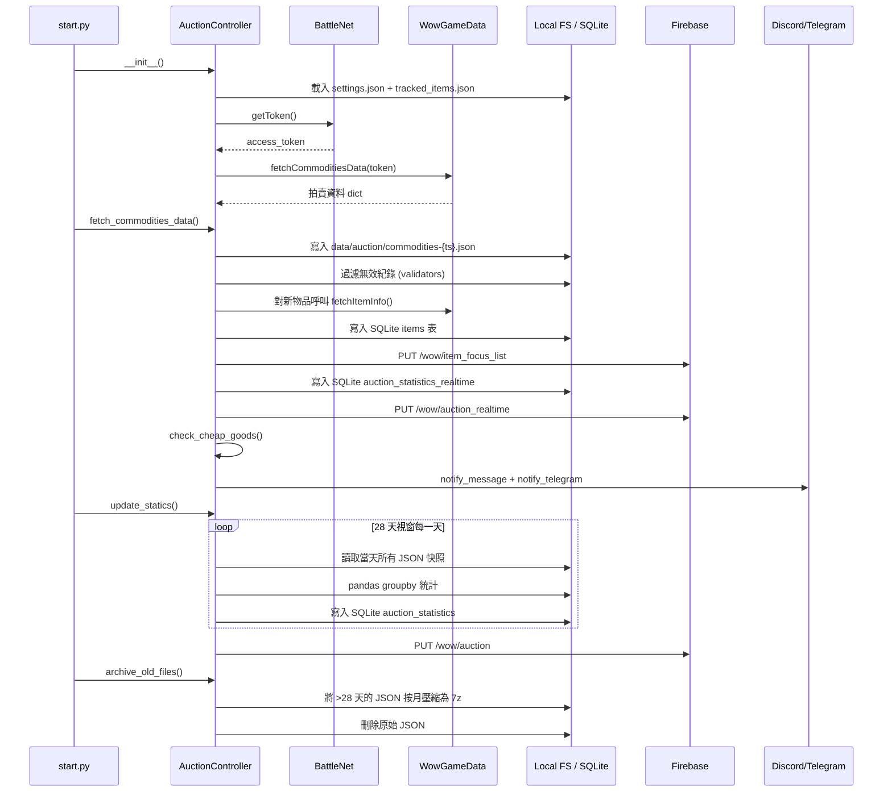
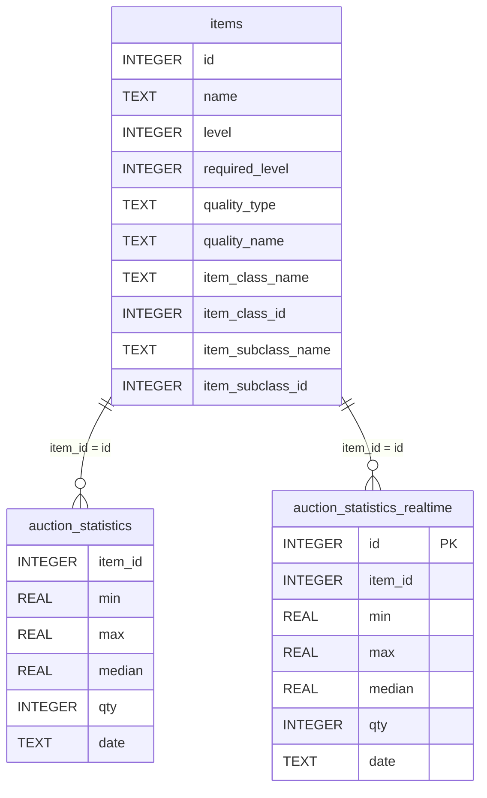

# 架構文件

## 1. 架構總覽

採 MVC 風格分層，所有外部 I/O 集中於 `services/` 與 `repositories/`，業務邏輯集中於 `controllers/AuctionController`。



## 2. 資料流（單次 `start.py` 執行）



## 3. 模組職責表

| 檔案 | 行數 | 職責 | 關鍵類別/方法 |
|------|------|------|---------------|
| `start.py` | 27 | 進入點：設定 logging、建立 Controller、依序呼叫三個主方法 | `setup_logging`、`AuctionController()` |
| `app/controllers/auction_controller.py` | 558 | 核心業務邏輯 | `AuctionController` 類別（見下方方法表） |
| `app/services/battle_net.py` | 40 | OAuth2 Client Credentials → access token | `BattleNet.getToken()` |
| `app/services/storage_firebase.py` | 206 | Firebase REST API（RT DB / Firestore / GCS） | `StorageFirebase`：`updateNodeByDict`、`updateCollection`、`uploadJsonByDict` 等 |
| `app/services/google_sheet.py` | 25 | Google Sheets 讀寫 | `GoogleSheet.getData / addRow / addRows / getColumnVals` |
| `app/repositories/wow_game_data.py` | 79 | Battle.net Game Data API 呼叫 | `WowGameData`：`fetchCommoditiesData`、`fetchItemInfo`、`fetchRealmsData` 等 |
| `app/helpers/validators.py` | 109 | 設定檔與拍賣紀錄驗證 | `validate_settings`、`validate_tracked_items`、`filter_valid_auction_records` |

### `AuctionController` 主要方法

| 方法 | 行 | 用途 |
|------|----|------|
| `__init__` | 25 | 載入兩份設定檔、驗證、取得 token、抓取首份拍賣資料 |
| `get_item_list` | 69 | 從 SQLite 撈出符合追蹤條件的 item_id 清單（threshold + classes + custom） |
| `statics_auction_records` | 86 | pandas groupby 計算每物品 min/max/median/qty |
| `update_statics` | 102 | 處理 28 天視窗的 JSON 快照，寫入 `auction_statistics`，同步至 Firebase RT DB |
| `fetch_commodities_data` | 188 | 寫入快照、更新物品清單、計算即時統計、觸發降價檢查 |
| `update_item_list` | 237 | 對新出現的 item_id 呼叫 `fetchItemInfo` 補齊 metadata |
| `check_cheap_goods` | 300 | SQL 比對即時價 vs 7 天最低價，篩出降幅 ≥ threshold 的物品 |
| `notify_message` | 387 | Discord Webhook 發送（2000 字元自動分批） |
| `notify_telegram` | 490 | Telegram Bot 發送（4096 字元自動分批） |
| `archive_old_files` | 448 | 超過 28 天 JSON 按月壓縮為 7z 並刪除原檔 |
| `query_item_quality` | 530 | 將同名物品按 ID 排序映射為 1/2/3 星級顯示 |

## 4. SQLite Schema

DDL 定義位於 `tests/conftest.py:42`（生產環境無獨立 schema 檔，由首次建表時 `INSERT` 隱式建立）。



**注意事項**：
- `items.id` 沒有設 PRIMARY KEY（歷史成因，`INSERT` 不會去重，仰賴應用層 `update_item_list` 比對 `archived_item_list` 後才插入）
- `auction_statistics_realtime` 每次 `fetch_commodities_data()` 都會 `DELETE` 全表後重建（`auction_controller.py:220`）
- `auction_statistics` 一個 `(item_id, date)` 對應一列；同日重複跑會被 `update_statics` 的「`SELECT ... WHERE date=?` 已有資料就跳過」邏輯擋掉（`auction_controller.py:128`）

## 5. Firebase 資料模型

```mermaid
graph TD
    Root[Firebase Project: jojocat-wow-f72a5]

    Root --> RTDB[Realtime Database]
    RTDB --> R1[/wow/auction<br/>28 天歷史統計]
    RTDB --> R2[/wow/auction_realtime<br/>即時統計]
    RTDB --> R3[/wow/item_focus_list<br/>追蹤物品 metadata]

    Root --> FS[Cloud Firestore]
    FS --> FS1[collection 命名<br/>視業務需求]
    FS1 --> FSD[document_id = YYYY-MM-DD<br/>28 天滾動視窗]

    Root --> GCS[Cloud Storage]
    GCS --> GCS1[bucket: jojocat-wow-f72a5.appspot.com]
    GCS1 --> GCS2[JSON 物件<br/>uploadJsonByDict]
```

來源：`storage_firebase.py:20-22`（`PROJECT_ID`、`DATABASE_URL`、`STORAGE_BUCKET` 常數）

## 6. 設計決策摘要

### 6.1 用 REST API 取代 firebase-admin
- **時間**：2026-04-05（見 `.claude/Task.md`）
- **動機**：`firebase-admin` 套件依賴 `grpcio`，於 Windows + Anaconda 環境安裝失敗率高
- **作法**：保留 `google-auth` 用於 OAuth2，所有 Firebase 操作改用 `AuthorizedSession` + REST endpoint，token 自動刷新
- **代價**：Firestore 寫入需自行處理 type wrapping（`_to_fs_value` / `_from_fs_value`，遞迴轉換 `integerValue` / `doubleValue` / `mapValue` 等）

### 6.2 28 天滾動視窗
- **動機**：拍賣資料量大（單份 JSON ~10 MB），保留更久會撐爆 pandas 記憶體
- **作法**：`history_days=28` 寫死在 `settings.json`；`update_statics` 只處理 `[今天 - 28, 今天]` 範圍的快照；`archive_old_files` 將更早的檔案 7z 壓縮後從工作目錄移除

### 6.3 7z 封存而非 zip
- **動機**：拍賣 JSON 可壓縮率極高（重複欄位多），7z 比 zip 多 30-50%
- **代價**：解壓縮需 `py7zr`（純 Python 實作，速度較慢但無 native 相依）

### 6.4 物品追蹤策略：threshold + classes + custom
- 採 OR 邏輯：`(id >= item_id_threshold AND class IN classes) OR (id IN custom_tracked_items)`
- `item_id_threshold` 用於排除舊版本物品（每次資料片更新會跳一個 ID 區間）
- `custom_tracked_items` 留給特殊低 ID 的長期關注物品（如脈石礦石 123918）
- 設定來源：`app/configs/tracked_items.json`，驗證邏輯：`validators.py:57`

### 6.5 SQL 條件 hardcoded 物品類別過濾
- `check_cheap_goods` 的 SQL 末段寫死 `item_class_id = 0 AND item_subclass_id IN (1, 3, 5, 9) OR item_class_id = 8`（`auction_controller.py:346`）
- 對應「消耗品的特定子類 + 寶石」，這層過濾**不**走 `tracked_item_classes` 設定，是 hardcoded 的通知策略
- 若要調整通知範圍，需直接改 SQL；非僅修改 JSON 設定可達成
